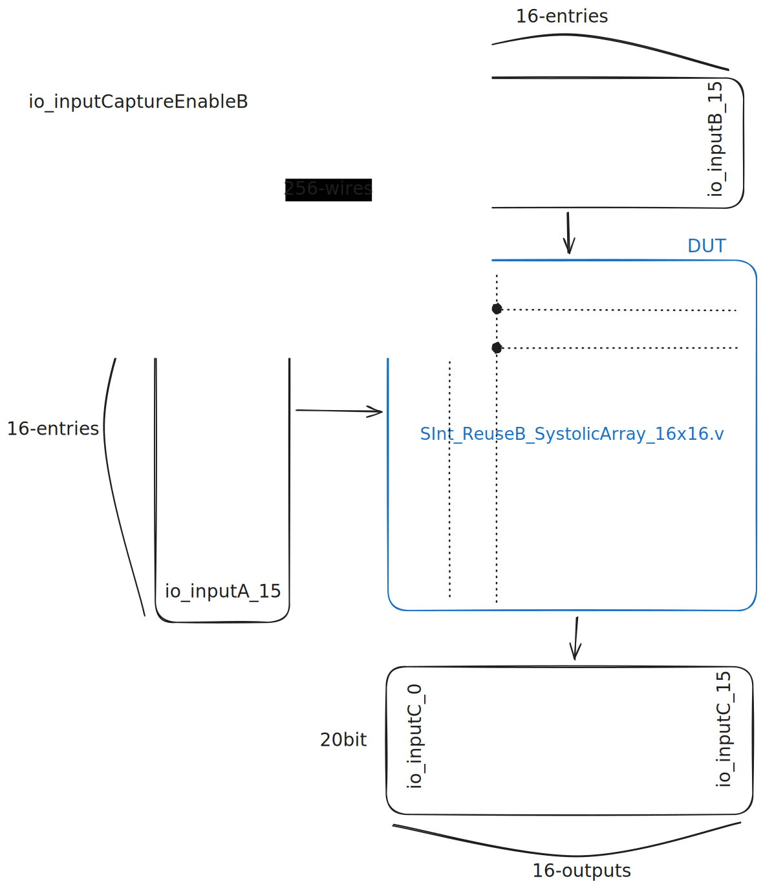

# TB for systolic array [SpinalSystolic](https://github.com/jooyeon111/SpinalSystolic)

ReuseB case TB



## Scenarios

### 1. Indentity test 
→ B : indentity / A : Incremental
### 2. Stationary & Back-to-Back Streaming Test 
→ B fixed / A : streaming immediately after the first matrix
### 3. Corner Case & Precision Test 
→ zero / max(8’h7f) / min(8'h80)
### 4. Weight Full Re-load Test 
→ B updating immediately after computation
### 5. Partial Weight Re-load Test 
→ some CaptureEnable enabled
### 6. Pipeline Fill & Drain Test 
→ 10 matric inject / the full cycle check

## setting

```bash
uv sync
uv run src/test/scripts/generate_vectors.py

# test vectors generated


```